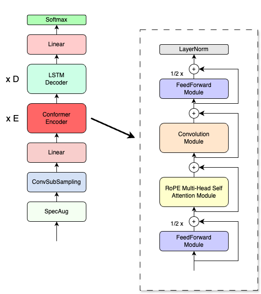

# Conformer with Rotary Positional Encoding for LibriSpeech

This repository contains the implementation of a Conformer model with Rotary Positional Encoding to train and evaluate on the LibriSpeech dataset.

## Table of Contents

- [1. Introduction](#1-introduction)
- [2. Model Architecture](#2-model-architecture)
- [3. Installation](#3-installation)
- [4. Usage](#4-usage)
    - [Configuration](#41-configuration)
    - [Training](#42-training)
    - [Evaluation](#43-evaluation)
- [5. License](#5-license)
- [6. Credits](#6-credits)
## 1. Introduction

This repository implements a [Conformer](https://arxiv.org/abs/2005.08100) model, which is renowned for its performance in speech recognition tasks. The Conformer model effectively combines convolutional neural networks (CNNs) and [Transformer-based](https://arxiv.org/abs/1706.03762) self-attention mechanisms. While maintaining the core architecture of the Conformer, I incorporate Rotary Positional Embeddings from [RoFormer](https://arxiv.org/abs/2104.09864) to improve the model's ability to capture long-range dependencies and provide a more robust representation of sequential data.

## 2. Model Architecture

<div align="center">


  
</div>


## 3. Installation

To get started, clone the repository and install the necessary dependencies:

```bash
git clone https://github.com/eufouria/RoPEConformer_s2t.git
```

For dataset preparation, download the [LibriSpeech](https://www.openslr.org/12) dataset and extract the files to a directory `data`.

```bash
wget -P data/ https://us.openslr.org/resources/12/train-clean-100.tar.gz
...
```

## 4. Usage

#### 4.1 Configuration

The configuration file (`config.json`) includes settings for:

- Dataset paths
- Model architecture
- Training parameters (learning rate, batch size, epochs, etc.)
- Audio processing settings
    
Ensure all paths and parameters are correctly set before running training or evaluation scripts.    

#### 4.2 Training

To train the model on the LibriSpeech dataset, run the following command:

```bash
python train.py --config config.json
```

#### 4.3 Evaluation

To evaluate the trained model on the test set, use:

```bash
python evaluate.py --config config.json --checkpoint checkpoints/checkpoint.pth
```
The evaluation script outputs WER (Word Error Rate) of the model.

## 5. License

This code is licensed under the BSD license. See the [LICENSE](LICENSE) file for more details.


## 6. Credits

This implementation is based on the work from the following sources:
- [XFormers Repo](https://github.com/facebookresearch/xformers/tree/main)
- [GPT-NeoX Repo](https://github.com/EleutherAI/gpt-neox)
- [RoFormer Paper](https://arxiv.org/abs/2104.09864)
- [Conformer Paper](https://arxiv.org/abs/2005.08100)
- [Unofficial Conformer Repo](https://github.com/sooftware/conformer)
- [Connectionist Temporal Classification](https://distill.pub/2017/ctc/)

---

If you have any questions or need further assistance, feel free to open an issue or contact me.

Happy coding!
